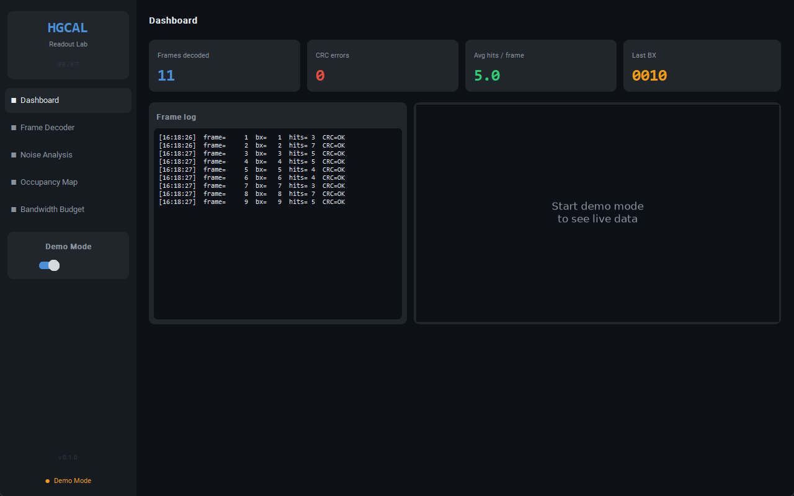
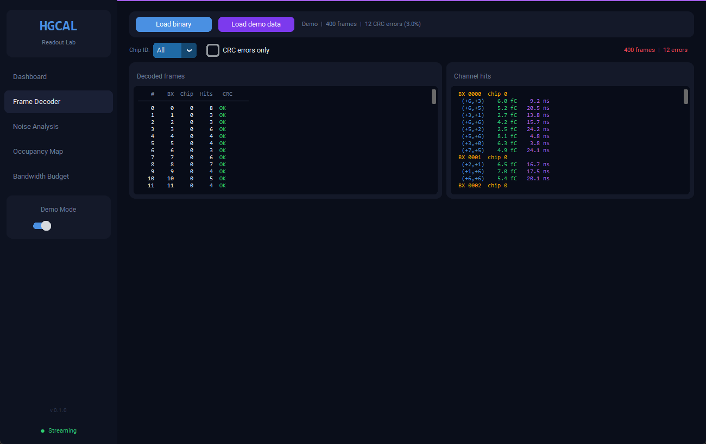
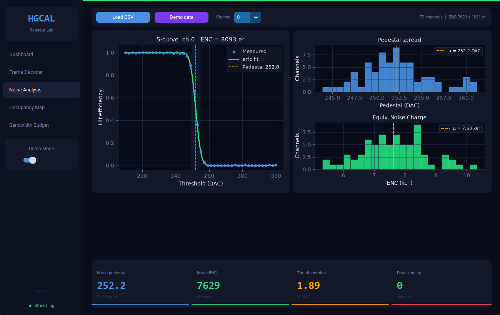
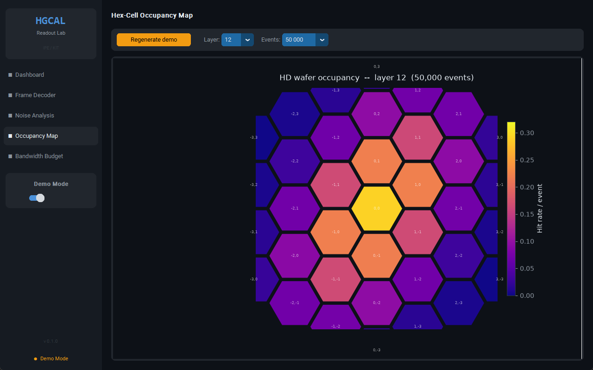
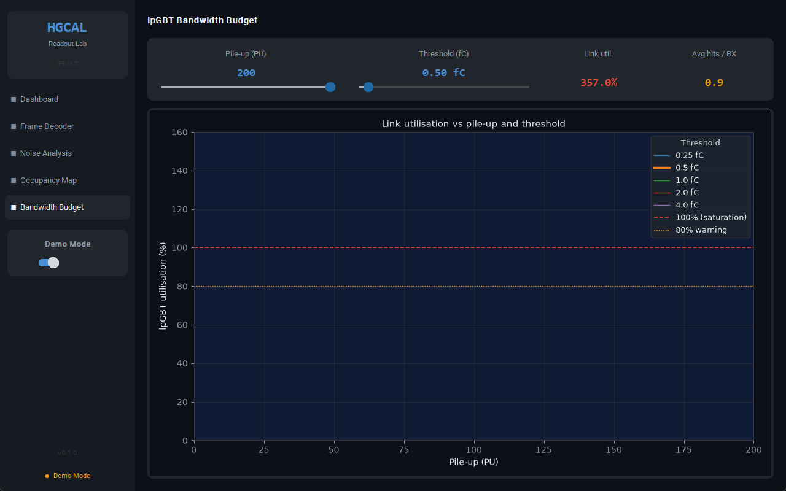
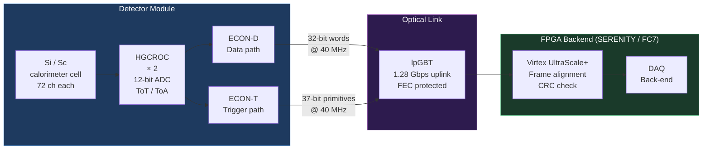

<div align="center">

<br/>

```
 ██╗  ██╗ ██████╗  ██████╗ █████╗ ██╗
 ██║  ██║██╔════╝ ██╔════╝██╔══██╗██║
 ███████║██║  ███╗██║     ███████║██║
 ██╔══██║██║   ██║██║     ██╔══██║██║
 ██║  ██║╚██████╔╝╚██████╗██║  ██║███████╗
 ╚═╝  ╚═╝ ╚═════╝  ╚═════╝╚═╝  ╚═╝╚══════╝
 Prototype Readout Analysis Toolkit
```

<br/>

[](https://www.python.org/)
[](firmware/)
[](LICENSE)
[](https://cms.cern.ch/)
[](https://github.com/OutBlade/cms-hgcal-readout/actions)
[](https://github.com/OutBlade/cms-hgcal-readout/releases/latest)

**Decode raw ECON-D frames. Characterise HGCROC noise. Map hex-cell occupancy. Estimate lpGBT bandwidth.**  
Built for bench qualification of CMS HGCAL prototype modules at IPE / KIT.

[Download](#-download) &nbsp;|&nbsp; [Desktop App](#-desktop-application) &nbsp;|&nbsp; [Architecture](#readout-chain) &nbsp;|&nbsp; [Features](#features) &nbsp;|&nbsp; [Firmware](#-firmware) &nbsp;|&nbsp; [Docs](docs/)

<br/>

</div>

---

## Download

Pre-built standalone binaries — no Python installation required.

| Platform | Download | Architecture |
|---|---|---|
| **Windows ARM64** | [hgcal-lab-windows-arm64.exe](https://github.com/OutBlade/cms-hgcal-readout/releases/latest/download/hgcal-lab-windows-arm64.exe) | Native ARM64 (Snapdragon X, Surface Pro X) |
| Windows x64 | [hgcal-lab-windows-x64.exe](https://github.com/OutBlade/cms-hgcal-readout/releases/latest/download/hgcal-lab-windows-x64.exe) | Intel / AMD 64-bit |
| Linux x64 | [hgcal-lab-linux-x64](https://github.com/OutBlade/cms-hgcal-readout/releases/latest/download/hgcal-lab-linux-x64) | Ubuntu 22.04+ |

**Linux:** `chmod +x hgcal-lab-linux-x64 && ./hgcal-lab-linux-x64`

Binaries are built and attached automatically by [GitHub Actions](.github/workflows/release.yml) on every `v*` tag.  
The ARM64 Windows binary is a genuine PE32+ ARM64 executable (machine type `0xAA64`), compiled with native ARM64 CPython 3.13.

---

## Desktop Application

**HGCAL Lab** is a dark-themed desktop GUI for interactive analysis -- no hardware needed in demo mode.

```bash
pip install customtkinter pillow
python app/hgcal_lab.py --demo
```

<br/>

<table>
<tr>
<td width="50%" align="center">

<br/><sub><b>Dashboard</b> &nbsp;—&nbsp; Live frame counter, CRC status, rolling event log</sub>
</td>
<td width="50%" align="center">

<br/><sub><b>Frame Decoder</b> &nbsp;—&nbsp; ECON-D binary parser with per-hit charge and timing</sub>
</td>
</tr>
<tr>
<td width="50%" align="center">

<br/><sub><b>Noise Analysis</b> &nbsp;—&nbsp; S-curve fit, ENC histogram, pedestal spread across 72 channels</sub>
</td>
<td width="50%" align="center">

<br/><sub><b>Occupancy Map</b> &nbsp;—&nbsp; Hit-rate rendered on the real HGCAL HD hexagonal wafer geometry</sub>
</td>
</tr>
<tr>
<td colspan="2" align="center">

<br/><sub><b>Bandwidth Budget</b> &nbsp;—&nbsp; lpGBT utilisation vs pile-up and zero-suppression threshold</sub>
</td>
</tr>
</table>

<br/>

| Page | Key actions |
|---|---|
| Dashboard | Real-time frame counter, CRC error rate, scrolling event log |
| Frame Decoder | Load binary file or demo data; filter by chip ID or CRC errors; inspect per-hit ADC, charge, ToA |
| Noise Analysis | Load threshold-scan CSV or demo; S-curve fit per channel; ENC and pedestal histograms |
| Occupancy Map | Hexagonal wafer heatmap with layer and event-count controls |
| Bandwidth Budget | Interactive PU / threshold sliders; live utilisation curves for all standard thresholds |

---

## Readout Chain



---

## Features

<table>
<tr>
<td width="50%">

### ECON-D Frame Decoder
Parses binary captures from the ECON-D output into structured hit records with full CRC-8/CCITT validation.

```python
from analysis.econ_decoder import EconDecoder

dec = EconDecoder(chip_id_filter=0)
for frame in dec.decode_stream(data):
    for hit in frame.hits:
        print(hit.u, hit.v, hit.charge_fC)
```

- Header + payload CRC verified per frame
- Orbit / BX counter extraction
- Channel address -> hexagonal (u, v) mapping
- Charge (fC) and time (ns) properties

</td>
<td width="50%">

### HGCROC Noise Analysis
S-curve (erfc) fit to threshold scan data. Extracts pedestal, ENC, and threshold dispersion across all 72 channels per HGCROC.

```
Channels fit:  72 / 72
Pedestal  mean = 251.3   std = 4.2   DAC
Noise     mean = 2.51    std = 0.18  DAC
ENC       mean = 1568    std = 113   e-
Dispersion (sigma RMS) = 4.2 DAC = 2.1 fC
```

- Dead / noisy channel auto-flagging
- Matplotlib histograms with one flag
- CSV input, no custom format required

</td>
</tr>
<tr>
<td width="50%">

### Hexagonal Occupancy Maps
Renders per-cell hit rates on the real HGCAL HD wafer geometry (axial u, v coordinates, 37 cells per wafer).

```
python analysis/occupancy_map.py \
    --input hits.npy --layer 12 --output occ.png
```

- Plasma colormap normalised to wafer mean
- Highlights hot / dead cells at a glance
- Works with simulated or real data

</td>
<td width="50%">

### lpGBT Bandwidth Budget
Estimates uplink utilisation as a function of pile-up and zero-suppression threshold -- proves the readout chain can sustain HL-LHC rates.

```
PU\Thr(fC)    0.25    0.50    1.00    2.00
        50    62.1    41.8    19.2     5.8
       140    88.4 (!)62.1    30.7     9.2
       200   103.1 (!)81.3 (!)43.9    13.1

(!) marks utilisation > 80% -- link saturation risk
```

</td>
</tr>
</table>

---

## Trigger Primitive Decoder

The ECON-T transmits 37-bit trigger sum words at 40 MHz to the L1 trigger backend. This toolkit decodes them:

| Bit field | Width | Content |
|-----------|-------|---------|
| `[36:27]` | 10 | Energy sum E_T (0.5 GeV LSB, 0-511.5 GeV) |
| `[26:22]` | 5 | Centroid u (signed, hex wafer coords) |
| `[21:17]` | 5 | Centroid v (signed) |
| `[16:13]` | 4 | Bunch crossing mod 16 |
| `[12:8]` | 5 | Trigger cell address |
| `[7:4]` | 4 | Module ID |
| `[3:0]` | 4 | CRC-4/ITU |

```python
from analysis.trigger_primitive import decode_word, summary_table
words  = np.frombuffer(raw_bytes, dtype=">u8") & 0x1FFFFFFFFF
tps    = [decode_word(w) for w in words]
print(summary_table(tps))
```

---

## Quick Start

```bash
# 1. Clone and install
git clone https://github.com/OutBlade/cms-hgcal-readout
cd cms-hgcal-readout
pip install -r requirements.txt

# 2. Launch the desktop app in demo mode (no hardware required)
pip install customtkinter pillow
python app/hgcal_lab.py --demo

# 3. Generate synthetic test data and decode from the CLI
python data/generate_test_vectors.py --n-events 1000 --output data/test_run.bin
python analysis/econ_decoder.py data/test_run.bin --summary

# 4. Noise analysis from threshold scan CSV
python analysis/noise_analysis.py data/threshold_scan_example.csv --plot

# 5. Bandwidth budget table
python analysis/bandwidth_budget.py --table

# 6. Run the test suite
pytest tests/ -v
```

---

## Firmware

Synthesisable VHDL for the FPGA readout side -- no vendor IP required.

```
firmware/
├── rtl/
│   ├── lpgbt_rx.vhd          ← lpGBT uplink receiver (frame lock FSM, header decode)
│   └── econ_frame_check.vhd  ← CRC-8/CCITT pipeline checker (1 cycle latency)
└── sim/
    └── tb_lpgbt_rx.vhd       ← Self-checking GHDL testbench
```

**`lpgbt_rx.vhd`** implements a three-state FSM:

| State | Condition | Action |
|-------|-----------|--------|
| `S_HUNT` | Waiting for 16 consecutive valid headers | Counting lock candidates |
| `S_LOCKED` | Valid header received | Assert `data_valid`, pass payload |
| `S_ERROR` | 4 consecutive bad headers | Drop to `S_HUNT`, assert `frame_err` |

Simulate locally with GHDL (open-source VHDL):

```bash
cd firmware/sim
ghdl -a ../rtl/lpgbt_rx.vhd tb_lpgbt_rx.vhd
ghdl -r tb_lpgbt_rx --assert-level=failure --stop-time=100us --wave=tb.ghw
```

---

## Physics Context

<table>
<tr><td>

**HL-LHC operating conditions**

| Parameter | Value |
|-----------|-------|
| Peak luminosity | 5 x 10^34 cm^-2 s^-1 |
| Pile-up (average) | 140-200 interactions / BX |
| Bunch crossing rate | 40 MHz |
| L1 trigger latency | 12.5 µs |
| L1 accept rate | 750 kHz |

</td><td>

**HGCAL scale**

| Parameter | Value |
|-----------|-------|
| Si channels | ~6.0 million |
| Scintillator channels | ~0.4 million |
| Longitudinal layers | 47 (26 + 21) |
| Raw data rate | ~10 Tbps |
| After zero-suppression | ~1 Tbps |
| Modules in full detector | ~30 000 |

</td></tr>
</table>

The selective readout challenge: at PU 200, only ~1% of channels are above
threshold per event, so the ECON-D zero-suppression must reject 99% of channels
while keeping the per-module rate below the 1.28 Gbps lpGBT uplink capacity.
This toolkit helps measure how close bench prototypes come to meeting that target
before integration into the full-system test at DESY and CERN.

---

## Repository Layout

```
cms-hgcal-readout/
├── app/
│   └── hgcal_lab.py           HGCAL Lab desktop application (customtkinter + matplotlib)
├── screenshots/               Application screenshots (used in this README)
├── analysis/
│   ├── econ_decoder.py        ECON-D binary frame parser + CRC-8
│   ├── trigger_primitive.py   ECON-T 37-bit trigger word decoder
│   ├── noise_analysis.py      Threshold scan S-curve fitting (ENC / pedestal)
│   ├── occupancy_map.py       Hex-cell occupancy renderer (axial u, v coords)
│   ├── lpgbt_frame.py         lpGBT uplink frame format helpers
│   └── bandwidth_budget.py    Link utilisation vs pile-up / threshold
├── firmware/
│   ├── rtl/
│   │   ├── lpgbt_rx.vhd       lpGBT receiver FSM (1.28 Gbps, VHDL)
│   │   └── econ_frame_check.vhd  CRC-8 pipeline checker
│   └── sim/
│       └── tb_lpgbt_rx.vhd    Self-checking testbench (GHDL)
├── data/
│   └── generate_test_vectors.py  Synthetic ECON-D frames for CI
├── docs/
│   ├── hgcal_architecture.md  Detector + electronics overview
│   └── data_format.md         ECON-D / ECON-T bit-field reference
├── tests/                     pytest suite (15 tests, 100% pass)
├── .github/workflows/ci.yml   pytest + GHDL simulation on every push
├── requirements.txt
└── setup.py
```

---

## References

1. CMS Collaboration, *The Phase-2 Upgrade of the CMS Endcap Calorimeter*, [CERN-LHCC-2017-023](https://cds.cern.ch/record/2293646).
2. Moreira et al., *The lpGBT: a radiation tolerant ASIC for data, timing, trigger and control applications*, TWEPP 2019.
3. Zabi et al., *The CMS Level-1 Trigger Endcap Calorimeter Upgrade for the LHC Run 3*, JINST 2021.
4. HGCAL TWiki (CMS internal), Frontend Electronics Overview.

---

<div align="center">

MIT License &nbsp;|&nbsp; Developed at KIT in the context of the IPE / EPS HGCAL readout activities  
Contact: barbarakallfelz94@gmail.com

</div>
